## PrimusUI
Great use of small stature, responsive page, focused on the mobile side, easy to manage, work for you to customize your own UI library.

Primus name from "Transformers".

Now many online open source UI library, coverage is very wide, can meet a lot of scenes. Because large and some small places may sometimes modify will be more strenuous.

If the actual development may have its own control UI library will save a lot of development time, and can freely modify a different code depending on the scene.

To this end, I draw a lot of online open source library, organize modify this simple set of code, we hope to develop will help.

This simple UI library, each CSS least a few dozen lines, as many as there is more than one hundred lines.

<a href="http://pwstrick.github.io/PrimusUI/default.html">Online demo（在线demo）</a>：


中文主页：<a href="http://pwstrick.github.io/PrimusUI">点击查看</a>

Online documentation（在线文档）：<a href="http://pwstrick.github.io/PrimusUI/docs/ui/typeface.html">Click to view</a>

## Ready Knowledge
1、CSS developed using now fashionable <a href="http://sass-lang.com/" target="_blank">SASS</a>, CSS preprocessor.

2、Code Morphing tool uses <a href="http://gulpjs.com/" target="_blank">Gulp</a>, enhanced workflow.
First install <a href="https://nodejs.org/en/" target="_blank">NodeJS</a>，
Package.json have a file in the project, which records the dependencies, enter "npm install" package can be installed in the current directory.

3、Is compiled from documents by the Jekyll,
<a href="http://jekyllrb.com/" target="_blank">Jekyll</a> is a static site generator.

4、With <a href="https://github.com/amfe/lib-flexible" target="_blank">flexible.js</a> by calculating the html font-size
(for calculating rem), set the magnification of the viewport to mobile adaptation. UI library, in addition to fonts, border width, etc.,
most of which are using rem as a unit, can be introduced (<a href="http://postcss.org/" target="_blank">PostCSS</a>)
plug-in "<a href="https://www.npmjs.com/package/px2rem" target="_blank">postcss-px2rem</a>", calculated automatically.

5、Browser is compatible attributes annoying thing by introducing plug PostCSS within
"<a href="https://www.npmjs.com/package/autoprefixer" target="_blank">autoprefixer</a>", automatically matching prefix.
Front and Article 5 paragraph 4 of the configuration write gulpfile.js.

## Directory Structure
```html
PrimusUI
└─ ─ ─ ─ assets UI library used to display page images, etc.
└─ ─ ─ ─ css SASS compiled CSS code
└─ ─ ─ ─ docs  UI library documentation, compiled by the tool Jekyll
└─ ─ ─ ─ font  Custom Fonts
└─ ─ ─ ─ js  JavaScript files
└─ ─ ─ ─ sass  CSS preprocessed file
└─ ─ ─ ─ site  Jekyll source file
└─ ─ gulpfile.js Gulp profile
└─ ─ package.json  Gulp required dependencies
└─ ─ open.bat  windows batch dos window to open in the current directory
└─ ─ *.html  UI library modules display page
```

## UI Library Features
1、Responsive layout, extensive use rem, elastic properties, the percentage of properties that can be adapted to a variety of mobile terminal screen.

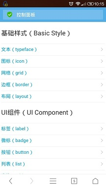

2、**normalize.scss**：Reset in the popular style "<a href="https://necolas.github.io/normalize.css/" target="_blank">normalize.css</a>"
based on the style to make adjustments more suitable mobile terminal.

3、**typeface.scss**：He cited a variety of scenarios font color and size, character truncation, conventional mobile terminal arrow mark.

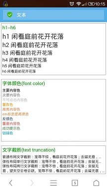

4、**icon.scss**：<a href="http://www.iconfont.cn/" target="_blank">Iconfont</a> in third-party libraries,
on-demand download existing icons can also upload svg files on this site, automatically made specific icon.

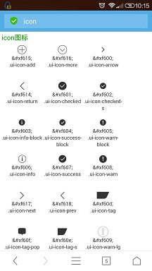

5、grid.scss：Grid achieve diversification,
Including advanced grid resilient settings (12 preset widths), set as a percentage (24 kinds of preset width), the left shift, move left, right movement (also 24 kinds).
End PC with a fixed width of different, different mobile end screen, so you can not set the width of each element will die. Elastic width or percentage after setting automatically calculated values.
Compared to traditional float layout, flexible layout easier to control, especially in alignment of the setting.

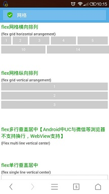

6、border.scss：Effective solution 1px border, in a variety of mobile terminal screen display problems.

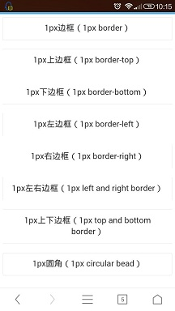

7、layout.scss：Layout styles preset six kinds of blank size, easy line, multi-line, on both sides of the elastic layout alignment.

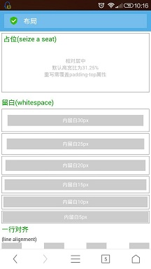

8、list.scss：Combined grid, layout style, you can achieve a variety of different scenes list shows, Loading effect can be customized.

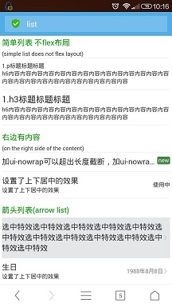

9、table.scss：The abstract form, the border, a list of color and other independent style, used in conjunction with the base class style.

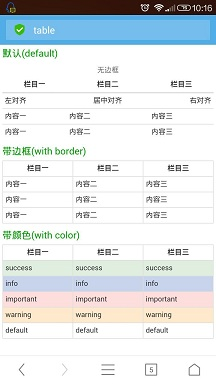

10、Label (label.scss), micro-scale (badge.scss), Button (button.scss)
each precompiled document provides private method can be extended according to the actual scenes.

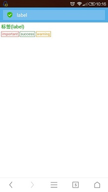
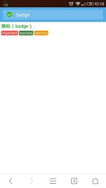
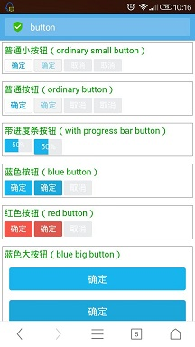

11、form.scss：CSS3 pseudo-element by re-landscaping the single box (radio.scss), checkbox (checkbox.scss), switch item (switch.scss).
Combined with the grid, buttons and other styles can be arranged in a variety of form items.

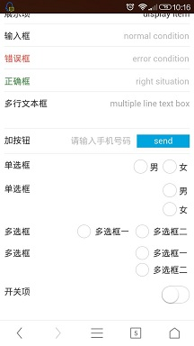

12、Setting global mixin in mixin.scss, when variable.scss configured global variables, high availability.

## Browser Compatibility
Android 2.3+

IOS 4.0+

## Contact Me
The use of PrimusUI have any questions, or find bug, please leave me feedback:
[Submit feedback](https://github.com/pwstrick/PrimusUI/issues/new)