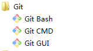
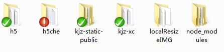
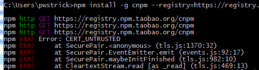
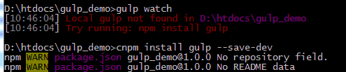
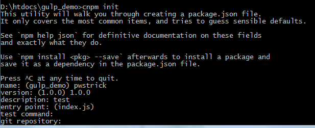
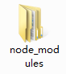

# 一、安装node.js

通过[nodejs](http://nodejs.cn/){:target="_blank"}的npm安装gulp，插件也可以通过npm安装。windows系统是个.msi工具。

只要一直下一步即可，软件会自动在写入环境变量中，这样就能在cmd命令窗口中直接使用node或npm指令。


上面的cmd，已经被[git](https://www.git-scm.com/){:target="_blank"}封装过了，字体都变成彩色的了。

安装了这个工具后，还可以通过Git Bash打Linux的命令。



# 二、npm

[npm](https://www.npmjs.com/){:target="_blank"}（node package manager）nodejs的包管理器，用于node插件管理（包括安装、卸载、管理依赖等）。

命令提示符执行：

```ruby
npm install <name> [-g] [--save-dev]
```

> 1. <name>：node插件名称。例：npm install gulp-less --save-dev
> 2. -g：全局安装。将会安装在C:\Users\Administrator\AppData\Roaming\npm，并且写入系统环境变量；
> 非全局安装：将会安装在当前定位目录；
> 全局安装可以通过命令行在任何地方调用它，本地安装将安装在定位目录的node_modules文件夹下，通过require()调用；
> 3. --save：将保存配置信息至package.json（package.json是nodejs项目配置文件）；
> 4. -dev：保存至package.json的devDependencies节点，不指定-dev将保存至dependencies节点

配置文件package.json是为了方便下载相关的包。

只需要在有这个文件的文件夹下面执行“npm install”（如果安装了cnpm就用“cnpm install”），则会根据package.json下载所有需要的包。

由于下载下来的“node_modules”文件会很多，不需要每个工程下面都下载一次，所以可以放到一个**公共的目录下面**。

例如下面的目录，下载的地方就放在项目的根目录。



# 三、cnpm

因为npm安装插件是从国外服务器下载，受网络影响大，可能出现异常。

在国内推荐使用[淘宝NPM镜像](https://npm.taobao.org/){:target="_blank"}。
“这是一个完整 npmjs.org 镜像，你可以用此代替官方版本(只读)，同步频率目前为 10分钟 一次以保证尽量与官方服务同步”。

安装指令如下：

```ruby
npm install -g cnpm --registry=https://registry.npm.taobao.org
```

注意安装的时候会出现错误提示，你可以关闭命令窗口再打开，打入“cnpm -v”可以查看版本号。cnpm跟npm用法完全一致。



# 四、全局安装gulp

注意下面的指令变成了“cnpm”：

```ruby
cnpm install gulp -g
```

如果在某个工程文件夹中提示错误，那就手动再安装下“[gulp](https://npm.taobao.org/package/gulp){:target="_blank"}”：



# 五、新建package.json文件

在命令窗口输入指令**“cnpm init”**。如果在Git Bash打这个指令，会报**“No gulpfile found”**的错误。



# 六、新建gulpfile.js文件

gulpfile.js是gulp项目的配置文件，里面是task的配置。简易代码如下：

```javascript
var gulp = require('gulp');
gulp.task('default', function() {
  // 将你的默认的任务代码放在这
});
```

# 七、删除node_modules文件夹

当安装了各种插件后，在你相应的目录下面会出现node_modules文件夹。

里面又嵌套了很深的文件夹目录，如果你用右键删除的方式，会变得很慢，并且还会提示错误“无法删除”。



这里有个方法，用npm里面一个专门用于删除的模块插件“[rimraf](https://npm.taobao.org/package/rimraf){:target="_blank"}”。

```ruby
cnpm install -g rimraf
```

只需要打简单的指令就可删除：

```ruby
cd xxx[include node_modules folder] //用cd指令将文件目录设置到包含nod_modules的位置
rimraf nod_modules
```