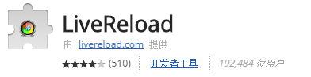
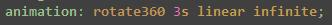
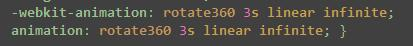
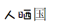

以下关于插件的说明以及配置等仅供参考。

> 1. Javascript打包工具使用的是webpack方式
> 2. CSS自动添加浏览器前缀使用了PostCSS插件中的“autoprefixer”
> 3. CSS中大部分的单位是rem，响应式开发。
> 4. 将px自动转换为rem，使用了一个PostCSS中的另外一个插件“postcss-px2rem”。

查看[config](../assets/js/config.js)示例文件，[gulpfile](../assets/js/gulpfile.js)示例文件。


# 一、全局配置Config

可以将需要在gulpfile中引用的参数，放到这里，包括一些路径、打包方式、rem计算基值、版本控制等。例如：

```javascript
var path = require('path');
module.exports = {
    //宏定义
    macro: {
        '__VERSION': Date.now().toString(16)
    },
    //CSS相关设置
    css: {
        rem: 64 //rem计算基值
    },
    //server相关设置
    server: {
        release: '../../../dist/2016/'+path.basename(__dirname)+'/', //发布目录
        port: 8002 //端口
    },
    //HTML相关
    html: {
        collapseWhitespace: true
    },
    //webpack打包
    webpack: {
        entry: {
            index : './js/index.js'
        },
        output: {
            filename: '[name].bundle.js',
        }
    }
};
```

# 二、监控gulp.watch

这个是gulp自带的，就是当你的文件改动了后，就做相应的task。在配置文件中可以引入“[gulp-watch](https://npm.taobao.org/package/gulp-watch){:target="_blank"}”。

监控sass中的文件变化，一有变化就做sass的编译。“**”与“*”这种语法可以参考《[Gulp：任务自动管理工具](http://javascript.ruanyifeng.com/tool/gulp.html){:target="_blank"}》

```javascript
gulp.task('watch', function() {
	livereload.listen();
	gulp.watch('sass/**/*.scss', ['sass']);
	gulp.watch('./build/css/**/*.css', ['css']);
	gulp.watch('js/**/*.js', ['js']);
	gulp.watch('**.html', ['html']);
});
```

livereload是用来监控页面修改，然后自动刷新页面修改部分，引用插件“[gulp-livereload](https://npm.taobao.org/package/gulp-livereload){:target="_blank"}”。

firefox或chrome要分别安装插件才可运行，chrom插件如下：



安装完后会在浏览器中出现个小按钮。


注意是黑色的时候才是在执行中，还有就是要在相应的task中加相应的代码“pipe(livereload())”。

```javascript
gulp.task('css', ['sass'], function () {
	return gulp.src('./build/css/**/*.css')
		.pipe(gulp.dest(dist+'css/'))
		.pipe(livereload());
});
```

# 三、sass编译与css压缩

通过sass编写css，能更模块化，多人协作比较方便。先安装“[gulp-sass](https://npm.taobao.org/package/gulp-sass){:target="_blank"}”。

1）“.on('error', sass.logError))”的作用是在编译错误的时候显示错误信息，但是不能中断编译。

2）“postcss”就是[PostCSS](http://postcss.org/){:target="_blank"}插件，执行px转rem的操作和自动添加CSS浏览器前缀。

3）要执行这两个功能，需要引入“[gulp-postcss](https://npm.taobao.org/package/gulp-postcss){:target="_blank"}”、
“[postcss-px2rem](https://npm.taobao.org/package/postcss-px2rem){:target="_blank"}”、
“[autoprefixer](https://npm.taobao.org/package/autoprefixer){:target="_blank"}”

4）插件“autoprefixer”不仅仅是自动加“-webkit”、“-moz”等的前缀，还能自动添加兼容代码，例如flex弹性布局的不同写法。

书写下图内容：



输出的内容如下：



```javascript
gulp.task('sass', function () {
	var processors = [px2rem({remUnit: config.css.rem}), autoprefixer()];
	return gulp.src('./sass/*.scss')
		.pipe(sass().on('error', sass.logError))
		.pipe(postcss(processors))
		.pipe(gulp.dest('./build/css/')).pipe(livereload());
});
```

编译sass与将css压缩到发布目录，分别放在了两个task中。

cssnano就是在做CSS压缩，需要引入“[gulp-cssnano](https://npm.taobao.org/package/gulp-cssnano){:target="_blank"}”。

```javascript
gulp.task('css', ['sass'], function () {
	return gulp.src('./build/css/**/*.css')
		.pipe(cssnano())
		.pipe(gulp.dest(dist+'css/'))
		.pipe(livereload());
});
```

# 四、JavaScript模块化合并与压缩

模块化合并使用“[webpack](http://webpack.github.io/docs/webpack-for-browserify-users.html){:target="_blank"}”，
需要引入插件“[webpack-stream](https://npm.taobao.org/package/webpack-stream){:target="_blank"}”，
github上面还有篇[说明教程](https://github.com/petehunt/webpack-howto/blob/master/README-zh.md){:target="_blank"}。

引用到了config.webpack中的配置参数。

```javascript
webpack: {
  entry: {
    index: './js/index.js'
  },
  output: {
    filename: '[name].bundle.js',
  }
}
```

```javascript
gulp.task('webpack', function () {
	return gulp.src('./js/*.js')
		.pipe(webpackStream(config.webpack))
		.pipe(gulp.dest('./build/js/')).pipe(livereload());
});
```

脚本的合并与压缩是在两个task中实现的。压缩引用了插件“[gulp-uglify](https://npm.taobao.org/package/gulp-uglify){:target="_blank"}”。

```javascript
gulp.task('js', ['webpack'], function () {
	return gulp.src('./build/js/*.js')
		.pipe(plumber())
		.pipe(uglify())
		.pipe(gulp.dest(dist+'js/')).pipe(livereload());
});
```

# 五、Image图片无损压缩

通过插件“[gulp-image](https://npm.taobao.org/package/gulp-image){:target="_blank"}”压缩的图片，有时候能牙70%以上，非常给力。

```javascript
gulp.task('image', function () {
	return gulp.src('./img/**')
		.pipe(image())
		.pipe(gulp.dest(dist+'img/'));
});
```


# 六、HTML压缩

1）将HTML文件压缩，可以缩小很多，有很多参数可以选择，比如去除空格（collapseWhitespace）等，
引入插件“[gulp-htmlmin](https://npm.taobao.org/package/gulp-htmlmin){:target="_blank"}”

2）给HTML中的JS文件、CSS文件等添加时间戳，可以防止更新后，还在被缓存。

```javascript
gulp.task('html', function () {
	//生成时间戳
	var stream = gulp.src('./*.html');
	for (var key in config.macro) {
		if (config.macro.hasOwnProperty(key)) {
			stream = stream.pipe(replace(key, config.macro[key]));
		}
	}
	return stream.pipe(htmlmin({collapseWhitespace: config.html.collapseWhitespace})).pipe(gulp.dest(dist)).pipe(livereload());
});
```

# 七、FontMin字体压缩

网上有很多webfont，例如国外的[Font Awesome](https://fortawesome.github.io/Font-Awesome/){:target="_blank"}，
国内的[iconfont](http://www.iconfont.cn/){:target="_blank"}。都能做出漂亮的自定义字体。

与西文字体不同，由于字符集过大，中文字体无法享受 webfont 带来的便利，为了让中文字体也这么便利，我们需要对其进行min。
引入插件“[gulp-fontmin](https://npm.taobao.org/package/gulp-fontmin){:target="_blank"}”。

```javascript
gulp.task('font', function() {
    gulp.src('font/*.+(eot|svg|ttf|woff)')
      .pipe(fontmin({
          text: '人晒'
      }))
      .pipe(gulp.dest('dist/font'));
});
```

配置的两个字“人晒”与没配置的“国”，明显有区别。



# 八、启动一个本地Server

有些操作需要一个服务器环境才能执行，例如ajax，所以需要配置一个。

引用插件“[gulp-connect](https://npm.taobao.org/package/gulp-connect){:target="_blank"}”，就可以实现本地的Server。

port参数可以在Config文件中定义。

```javascript
gulp.task('server', function () {
	connect.server({
		root: dist,
		port: config.server.port
	});
});
```

